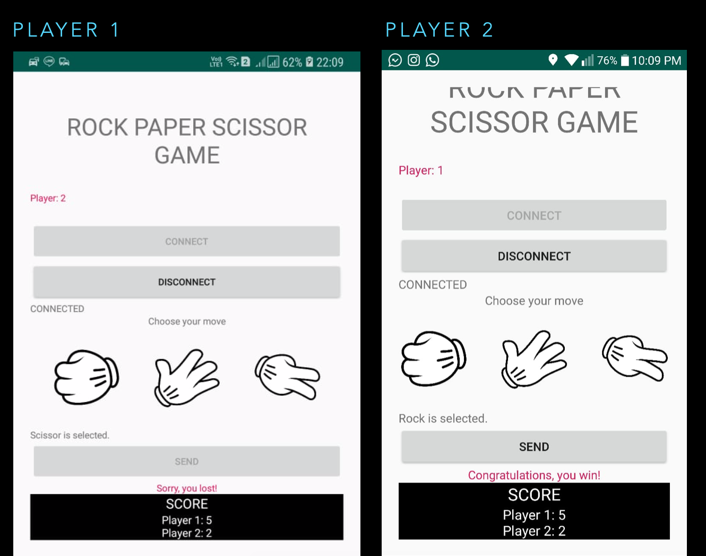

# rock_paper_scissor

This is a simple Android app of the game rock-paper-scissor, a mid-term project for the course Network and Mobile Programming. Rock–paper–scissor is a hand game usually played between two people, in which each player simultaneously forms one of three shapes with an outstretched hand. This program uses Java in the client or the application side, and Python in the server side. The libraries that are used in the program include socket and sys. This application only works locally, where the two Android devices must be connected to the same network.

The server only accepts two clients that can play at the same time. In the beginning the two players must set which is the first and the second player. The server listens during the game lifetime. The players (clients) will choose their move and get a result whether they win or loose after the other player has chosen their move.

Preview of the application:

